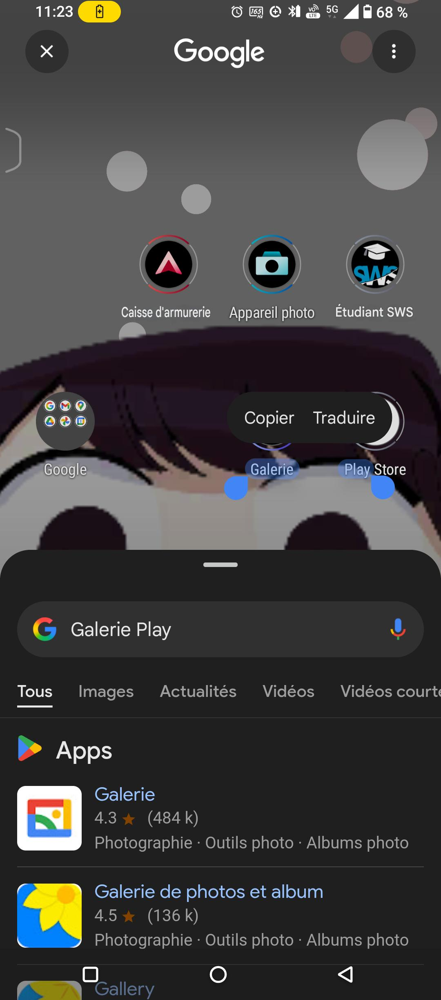
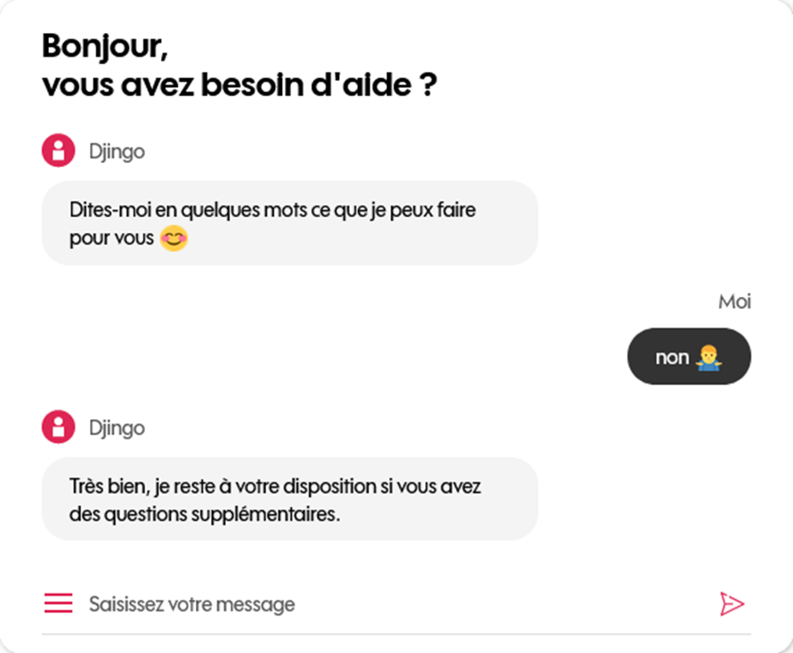

# Analyse de 3 Chatbots

## Analyse 1 — Siri

### Type de chatbot

- Machine Learning + reconnaissance vocale
- Basé sur des modèles NLP classiques (pas génératif par défaut)

### Domaine d'application

- Assistant personnel : appels, SMS, rappels, météo, domotique, etc.

### Modalité d'interaction

- Voix (principal)
- Peut aussi fonctionner en texte (accessibilité)

### Capacités

- Compréhension vocale
- Reconnaît le langage naturel
- Gère le contexte conversationnel (ex : suites logiques de questions)
- Accès aux apps natives (appels, messages, domotique)

### Limitations identifiées

- Ne comprend pas toutes les langues/localismes
- Réponses rigides, peu personnalisables
- Dépend fortement de la qualité du micro/réseau

### Architecture supposée

| Composant | Description |
|-----------|-------------|
| NLP Core | SiriKit + modèle ML interne Apple |
| Traitement vocal | Apple Speech API |
| Backend | Apple Cloud, intégration iOS |
| Moteur de règles | Scénarios prédéfinis |
| Sécurité | Traitement local + envoi serveur chiffré |

*Note : N'ayant pas d'iPhone, cette analyse se base sur la documentation publique et les retours d'expérience utilisateurs.*

---

## Analyse 2 — ChatGPT (OpenAI)

### Type de chatbot

- IA générative (LLM, ex: GPT-4)
- Apprend par prompt engineering

### Domaine d'application

- Polyvalent : assistant personnel, aide à l'écriture, support client, e-commerce, code…

### Modalité d'interaction

- Texte (web, mobile, API)
- Voix (via intégration mobile ou assistants vocaux)
- Multimodal (texte + image + audio avec certaines versions)

### Capacités

- Compréhension avancée du langage naturel
- Gestion contextuelle poussée
- Personnalisation via mémoire (dans certains cas)
- Génération de texte fluide et informé

### Limitations identifiées

- Peut halluciner ou inventer des informations
- Dépend de l'entraînement (pas connecté au web en temps réel sauf avec plugins/API)
- Parfois trop verbeux ou vague

### Architecture supposée

| Composant | Description |
|-----------|-------------|
| LLM Core | GPT-4 (OpenAI) |
| Interaction frontend | Interface web/mobile |
| Mémoire utilisateur | Stockée localement ou sur serveur selon config |
| Traitement multimodal | Vision/audio (avec GPT-4o) |

**Discussions avec ChatGPT :** [Lien vers la conversation](https://chatgpt.com/share/6864f716-4ecc-8010-bcba-42e30c436718)

---

## Analyse 3 — Chatbot Fnac (E-commerce)

### Type de chatbot

- Hybride : règles + NLP classique
- Non génératif (pas d'IA type LLM)

### Domaine d'application

- Service client e-commerce :
  - Recherche de produits, commandes, livraisons
  - Support technique produits high-tech
  - Gestion des retours et remboursements
  - Redirection vers agent humain si besoin

### Modalité d'interaction

- Texte via widget web intégré sur le site fnac.com
- Pas d'interaction vocale ou multimodale

### Capacités

- Compréhension basique du langage naturel (NLP)
- Gestion du contexte immédiat dans un scénario d'achat
- Actions courantes : suivi commande, recherche produit, politique de retour
- Personnalisation si client connecté à son compte Fnac

### Limitations identifiées

- Ne comprend pas les formulations ambiguës ou les fautes d'orthographe
- Ne gère pas les demandes complexes multi-produits
- Réponses parfois trop rigides et scriptées
- Redirection fréquente vers le support humain pour les cas spécifiques

### Architecture supposée

| Composant | Description |
|-----------|-------------|
| Frontend | Widget JavaScript de chat intégré au site web |
| NLP Engine | Dialogflow ou moteur interne avec intents prédéfinis |
| Backend APIs | Connexion aux services Fnac (catalogue, commandes, CRM) |
| Moteur de règles | Système de workflow scripté pour les scénarios e-commerce |
| Escalade humaine | Passage vers un conseiller humain via interface de chat live |

