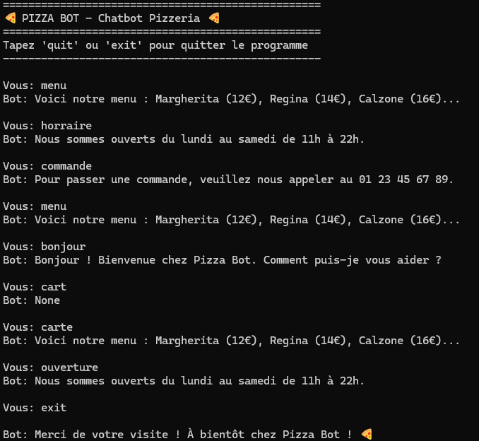
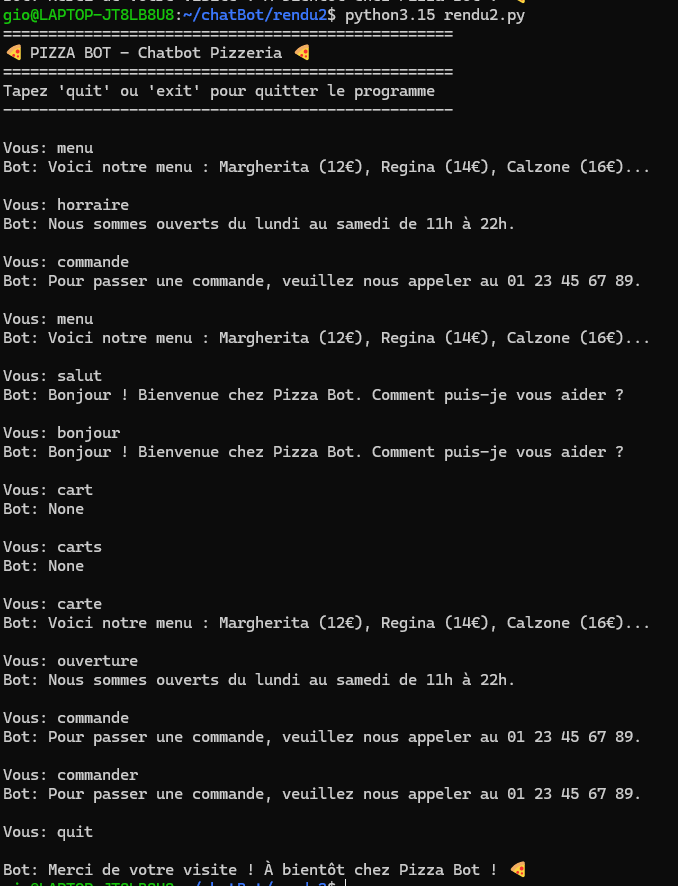

# Chatbot Pizzeria - Rendu 2

## Captures d'écran

### Interface d'accueil


### Exemple de conversation


## Utilisation

Pour lancer le chatbot, exécutez la commande suivante dans votre terminal :

```bash
python rendu2.py
```

### Exemples de commandes

- **Salutation** : "bonjour", "salut"
- **Menu** : "menu", "carte"
- **Quitter** : "quit", "exit", "quitter", "sortir"

## Architecture technique

- **Type** : Chatbot basé sur des règles
- **Langage** : Python 3
- **Interface** : Terminal/Console
- **Méthode** : Correspondance de mots-clés avec `if/elif`
