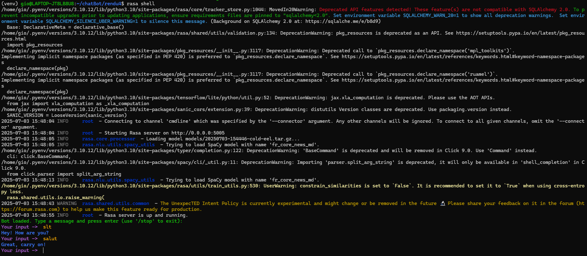
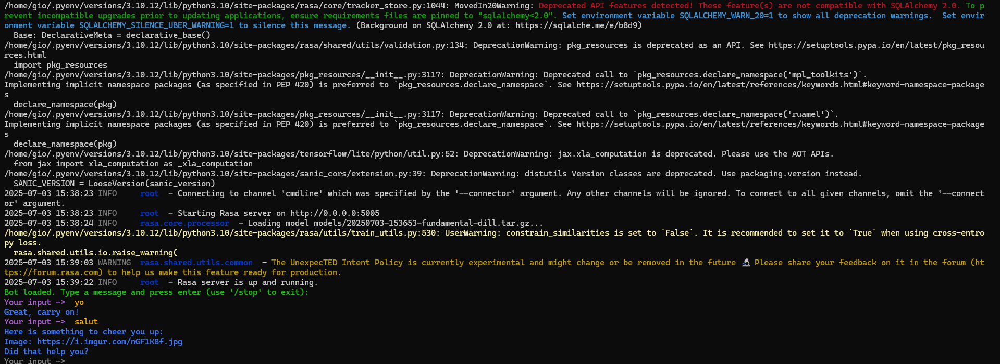
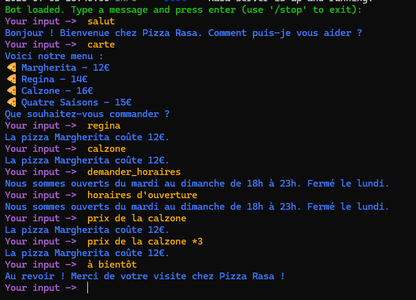

# Pizza Rasa - Chatbot en français 🇫🇷

## Présentation

Ce projet est un chatbot Rasa fonctionnel, capable de comprendre et répondre en français pour une pizzeria fictive.

## Livrable Partie 1 : Capture d'écran montrant Rasa fonctionnel + fichiers de configuration

- Le bot comprend le français et répond en français grâce à l'intégration de spaCy et du modèle `fr_core_news_md`.
- Exemple de dialogue :



- Si la librairie spaCy FR n'est pas installée, Rasa affiche une erreur (voir ci-dessous) :



## Livrable Partie 2 : Bot Rasa fonctionnel avec test de 5 dialogues différents

- Exemple de dialogues de test :



## Livrables finaux

- Projet Rasa complet et fonctionnel (code, configuration, données d'entraînement)
- Documentation technique (ce README)
- 5 captures d'écran de dialogues de test
- Rapport de 2 pages sur les difficultés rencontrées et solutions apportées

## Installation rapide

```bash
# Installer les dépendances système nécessaires (Debian/Ubuntu)
sudo apt-get update && sudo apt-get install -y libffi-dev libssl-dev zlib1g-dev libbz2-dev libreadline-dev libsqlite3-dev build-essential liblzma-dev tk-dev

# Installer les dépendances Python
pip install -r requirements.txt

# Télécharger le modèle spaCy français
python -m spacy download fr_core_news_md
```

## Lancement du bot

```bash
rasa train
rasa shell
```

## Difficultés rencontrées et solutions

- Problème de compatibilité Python/Rasa : Rasa 3.x nécessite Python ≤ 3.10. Solution : installation via pyenv.
- Problème de support du français : ajout de spaCy et du modèle `fr_core_news_md`.
- Problèmes de validation YAML : correction des slots, intents et structure des fichiers.
- Traduction complète des réponses et intents pour une expérience utilisateur 100% française.
- Il a été nécessaire de réaliser les parties 2 et 3 en parallèle pour garantir le bon fonctionnement du projet.
